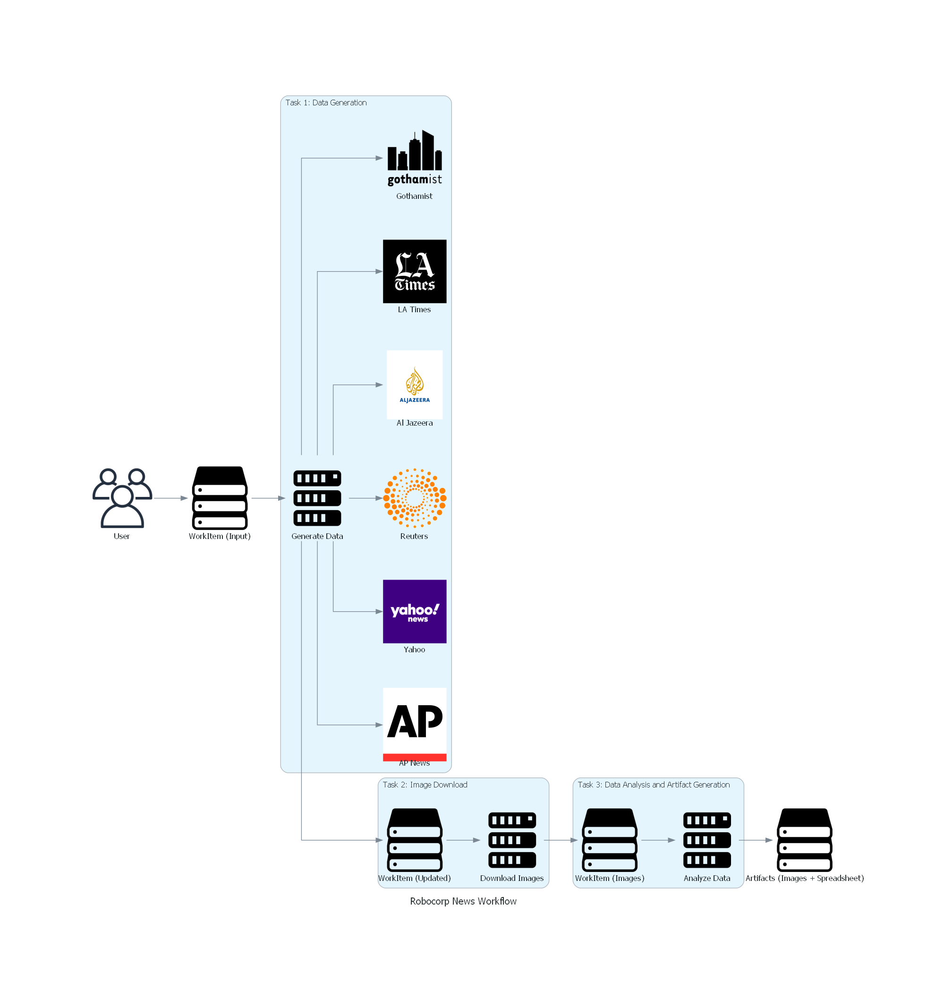

# Robocorp News

Robocorp News is a modular project designed to search for news articles on websites based on given search terms and additional parameters such as date or duration in months. Initially, the project supports the AP News website, with future plans to extend compatibility to other news websites including Yahoo, Reuters, Al Jazeera, LA Times, and Gothamist.

## Table of Contents

<details>
<ol>
    <li><a rel="norrefer" href="#overview">Overview</a></li>
    <li><a rel="norrefer" href="#features">Features</a></li>
    <li><a rel="norrefer" href="#usage">Usage</a></li>
    <ol>
        <li><a rel="norrefer" href="#input-parameters">Input Parameters</a></li>
        <li><a rel="norrefer" href="#output-parameters">Output</a></li>
    </ol>
    <li><a rel="norrefer" href="#tasks">Tasks</a></li>
    <ol>
        <li><a rel="norrefer" href="#task-1-data-generation">Task 1: Data Generation</a></li>
        <li><a rel="norrefer" href="#task-2-image-donwload">Task2: Image Download</a></li>
        <li><a rel="norrefer" href="#task-3-data-analysis-and-artifact-generation">Task 3: Data Analysis and Artifact Generation</a></li>
    </ol>
    <li><a rel="norrefer" href="#installation">Installation</a></li>
    <li><a rel="norrefer" href="#future-work">Future Work</a></li>
    <li><a rel="norrefer" href="#contributing">Contributing</a></li>
    <li><a rel="norrefer" href="#license">License</a></li>
</ol>
</details>

## Overview

Robocorp News automates the process of fetching news articles based on user-defined search terms, category and parameters. The project is built to be modular, allowing for easy integration of additional news sources in the future, and opertaions. The core functionality involves generating search results, processing the data, and producing final artifacts which include images and a consolidated spreadsheet.

## Features

- Search news articles based on specified term.
- Filter based in categories
- Support for date-specific searches or searches within a given time limit.
- Modular design for future integration with additional news websites.
- Generation of comprehensive output including titles, descriptions, images, search term frequency, and monetary mentions.
- Creation of a consolidated spreadsheet and image download functionality.

## Usage

### Input Parameters

The project accepts the following input parameters through work items:

- **Search Term**: The term to be searched within the news articles.
- **Categories (Optional)**: List of categories to be filtered.
- **Website**: The website to search for news articles (currently supports AP News).
- **Since at**: Specific date in ISO format or the number of moths to look back for searching news articles.
- **Browser timeout**: Timeout used for screen switching time in the browser 
- **Browser Config (Optional)**: Additional configurations to help the browser to do the search.

Example:

````json5
{
  "site": "apnews.com",
  "search": "technology",
  "categories": [
    "stories",
    "videos",
    "blablabla"  // Will not be found
  ],
  "since": "2024-08-03T00:00:00+00:00",  // Can be a number
  "browser_timeout": 600,
  "browser_config": {
    "headless": true
  }
}
````

### Output

The output is structured in a multi-stage process:

- Initial data including titles, descriptions, image links, search term, and date.
- Downloaded images associated with the news articles.
- A spreadsheet summarizing the data, including the frequency of the search term in titles and descriptions, and mentions of monetary amounts.


## Tasks



> This diagram was generated using the `diagram_gen.py` program.

### Task 1: Data Generation

- **Description**: This task generates initial data based on the provided search term, categories, website, and the date or month parameters. The output includes titles, descriptions, image links, search term and date.
- **Inputs**: Search Term, Categories, Website, Date/Months
- **Outputs**: Work items containing titles, descriptions, image links, search term, and date.

### Task 2: Image Download

- **Description**: This task reads the generated work items, downloads the associated images, and updates the work items with the downloaded images.
- **Inputs**: Work items from Task 1
- **Outputs**: Updated work items with downloaded images.

### Task 3: Data Analysis and Artifact Generation

- **Description**: This task analyzes the data to count the frequency of the search term in titles and descriptions, identifies any monetary mentions, and compiles a consolidated spreadsheet. The final output includes saved images and the spreadsheet as artifacts.
- **Inputs**: Work items from Task 2
- **Outputs**: Artifacts including images and a consolidated spreadsheet.


## Installation

To install and run the Robocorp News project, follow these steps:

Clone the repository.
Open the visual studio code.
Instal robocorp extensions:


The Robocorp extensions will automatically configure the environment.

```bash
git clone https://github.com/erosg11/robocorp-news.git

cd robocorp-news

code .

# Use the robocorp extensions to automatically configure your enviroment
```

## Future Work

- Integration with additional news websites: Yahoo, Reuters, Al Jazeera, LA Times, and Gothamist.
- Enhanced data analysis capabilities.

## Contributing
We welcome contributions from the community. If you wish to contribute, please follow these steps:

1. Fork the repository.
2. Create a feature branch (git checkout -b feature/ISSUE-`N`).
3. Commit your changes (`git commit -m 'Add some feature'`).
4. Push to the branch (`git push origin feature-branch`).
5. Open a pull request.

Please ensure your code adheres to the project's coding standards and includes appropriate tests.

## License
This project is licensed under the MIT License. See the LICENSE file for details.

For more information or any questions, please open a issue.